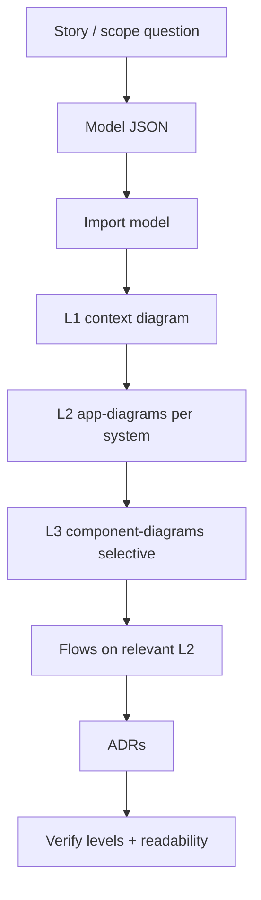

# Workflows — C4-first

**Philosophy:** [c4-methodology.md](c4-methodology.md) · **Avoid:** [anti-patterns.md](anti-patterns.md) · **Project:** [overlay.md](overlay.md)

This replaces the old "phase gate" pipeline. Steps are **ordered by C4 level**, not by agent role theater.

---

## End-to-end (portfolio)



---

## Step 0 — Scope (before JSON)

Answer:

1. What should a human understand in **30 seconds**? → drives L1
2. Which **systems** need container detail? → drives L2 list
3. Which **apps** have modeled components worth L3?
4. Which **story** needs a flow? (e.g. PR debounce → review → comment)

**Default for Patrick portfolio:** one landscape (`portfolio`), not five silos.

---

## Step 1 — Model

**Owner:** Modeler · Contract: `AGENT_BRIEF.md` + [agents/MODELER.md](agents/MODELER.md)

```
imports/<slug>.json              LandscapeImportData (full merge for portfolio)
imports/<slug>-adrs.json         ADR array
reports/<slug>-model-map.json    live id map (after dump)
```

### Portfolio merge pattern

Detail from k8s / governance / coldsearch / archiver → **objects under portfolio systems**, not separate share-link hops.

Preferred files:

```
imports/portfolio-megamap-full.json     merged model
imports/portfolio-l3-components-patch.json   components (merge into full before import)
```

### Push

```http
POST /landscapes/{landscapeId}/versions/latest/import?prune=false
```

Poll `GET .../import/{landscapeImportId}` until `status: completed`.

**Do not** patch-import partial JSON against live ids unless you have verified parent ids from `reports/portfolio-model-map.json`.

### Model exit criteria

```
[ ] import status = completed
[ ] L1 candidates present: actors, systems, externals (no apps required on model root)
[ ] Each major system has apps/stores if L2 is planned
[ ] Components exist only under apps/stores (hierarchy valid)
[ ] Dump: powershell ... icepanel-dump-model.ps1 portfolio
```

---

## Step 2 — L1 context diagram

**Owner:** Diagrammer · [agents/DIAGRAMMER.md](agents/DIAGRAMMER.md)

**One** `context-diagram` scoped to domain.

**On canvas:** actors, systems, external systems **only**.

```
imports/diagrams/portfolio-l1-context.json
```

Generate from live model:

```powershell
python tools/gen-portfolio-c4-levels.py
```

Push full C4 set:

```powershell
doppler run -p dev-tools -c dev -- powershell -File .\tools\icepanel-push-c4-levels.ps1
```

### L1 exit criteria

```
[ ] type = context-diagram, pinned = true
[ ] zero apps / components on canvas
[ ] ~10–20 boxes, readable labels
[ ] name like "Portfolio - Context (L1)" — NOT "Variant" or "Hub"
[ ] export PNG passes spot-check
```

---

## Step 3 — L2 app-diagrams

**One per major internal system** (`type: app-diagram`, `modelId` = system id).

Portfolio set (current):

| File | System |
|------|--------|
| `portfolio-l2-homelab.json` | Homelab Platform |
| `portfolio-l2-aireview.json` | AI PR Review Pipeline |
| `portfolio-l2-governance.json` | Agent Governance |
| `portfolio-l2-coldsearch.json` | ColdSearch |
| `portfolio-l2-archive.json` | LLM Conversation Archive |
| `portfolio-l2-corpus.json` | Agent Learning Corpus |

**On canvas:** apps, stores, groups (as areas). Connections within system.

### L2 exit criteria

```
[ ] each major system has its own app-diagram
[ ] groups use shape area + type group (not system)
[ ] drill-down from L1 system opens matching L2 in UI
```

---

## Step 4 — L3 component-diagrams (selective)

Only when components exist **and** matter.

Portfolio set (current):

| File | App |
|------|-----|
| `portfolio-l3-workflow.json` | PR debounce workflow |
| `portfolio-l3-openhands.json` | OpenHands |
| `portfolio-l3-litellm.json` | LiteLLM |
| `portfolio-l3-guardian.json` | Guardian |
| `portfolio-l3-aireview-comp.json` | AI Review app internals |

Skip L3 for systems with no components or no story need.

---

## Step 5 — Flows

Requires diagram id from L2 (usually AI PR Review).

Guide: [reference/flows-storytelling.md](reference/flows-storytelling.md)

**Portfolio priority flow:** PR event → debounce → runner → OpenHands + AI Review → LiteLLM → Qwen → GitHub comments.

```
[ ] flow attached to existing diagram (not floating)
[ ] introduction + conclusion text
[ ] steps reference objects on that diagram
```

---

## Step 6 — ADRs

```http
POST /landscapes/{landscapeId}/versions/latest/adrs
```

2–4 per landscape: BYOK, advisory-only, debounce, self-hosted runner.

ASCII only. Separate from import body.

---

## Step 7 — Verify

**Owner:** [agents/VERIFIER.md](agents/VERIFIER.md)

Success = **correct C4**, not merely diagram count ≥ 1.

```
[ ] L1 has no apps
[ ] L2 count matches major systems
[ ] L3 only where components modeled
[ ] no portfolio-variant-* diagrams in live landscape
[ ] share link renders L1 first
[ ] reports/diagram-verify.md written
```

---

## Merge strategies (when consolidating satellites)

| Strategy | When | After |
|----------|------|-------|
| Export → merge JSON → import | Multiple sources | Regenerate **all** L1/L2/L3 from model map |
| Copy API | Single source overwrite | Verify diagrams; often need recreate |
| Duplicate | Experiments only | — |

**Never** merge models then leave old variant diagrams in place — run `icepanel-push-c4-levels.ps1` (deletes all diagrams, pushes clean set).

---

## UI diagnosis

| UI state | Meaning | Action |
|----------|---------|--------|
| Dependencies populated, Diagrams 0 | Model only | Run C4 push |
| L1 shows apps | Wrong level | Regenerate L1 from gen script |
| Sidebar "Variant A/B/C/D" | Legacy anti-pattern | Delete; push C4 set |
| "In 0 diagrams" on objects | No views | L1/L2/L3 |
| L1 ok, no L2 | Missing drill-down | Add app-diagrams |

---

## Debugging

| Symptom | Cause | Fix |
|---------|-------|-----|
| Blank canvas | 0 diagrams | push-c4-levels |
| 400 on POST diagram | apps on L1 body; area on system | c4-methodology |
| 500 duplicate handleId | Re-post same handle | delete diagram first |
| Parent not found on import | Partial patch | full merged JSON |
| Mojibake in ADR | Non-ASCII | strip to ASCII |

Forensics: `GET .../action-logs?filter[actionType]=diagram-create&limit=5`

---

## Auth

```powershell
doppler run -p dev-tools -c dev -- powershell -File .\tools\icepanel-healthcheck.ps1
```

Org: `8kpJ4KngNPCU2sbVFkgV` · Portfolio: `Efdez5uW6BfQjErrQ4Gx`

---

## Deprecated workflow steps

| Old | Replacement |
|-----|-------------|
| Phase 1–4 agent dispatch table | Steps 1–7 by C4 level |
| `icepanel-layout.ps1` as deliverable | `gen-portfolio-c4-levels.py` |
| `portfolio-variant-*` push | `icepanel-push-c4-levels.ps1` |
| Integrator as separate silo linker | Merge into portfolio model + L2 |
| "diagram count ≥ 1" verifier | Level-aware verifier |
